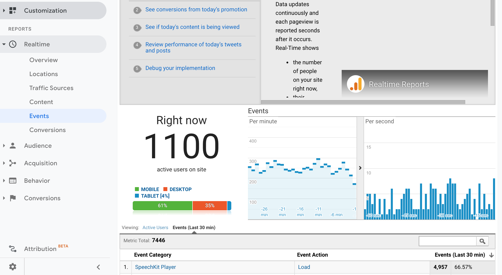

# Integrating Google Analytics

### Getting Setup


Note that this feature is still in beta and only available on request, so you will need to contact us in order to integrate.


Firstly, an active account with [Google Analytics](http://www.google.com/analytics) is required to use this feature. All we require to get you set up is your unique Google Analytics account number.  
This number resembles _UA-XXXXXX-X_.

Once we have activated Google Analytics for you, events will be sent directly to your Google Analytics account. 

### Making Sense of the data

Firstly, to confirm the events are arriving within the dashboard, browse to **Realtime &gt; Events** and you should see the new events within the Google Analytics dashboard.

All events will be have an **Event Category** of '_SpeechKit Player'_ ****so you can easily distinguish and filter all SpeechKit events. Each event will also have an **Action** property which describes the event type captured \(eg. _Load/Play_\) and a **Label** which will be the URL of the page on which the event occurred.

The current sent of **Event Actions** sent to Analytics from the player are:

* Load \(Fired once, when the player has loaded\)
* Play \(First time the user clicks play. Subsequent play/pause events are not currently recorded\)
* 25% Watched
* 50% Watched
* 75% Watched
* Complete

If you also have ads enabled, you may see the following ad-related events:

* Ad Play
* Ad 25% Watched
* Ad 50% Watched
* Ad 75% Watched
* Ad Complete
* Ad Link Click
* Ad Logo Click

To make sure you are receiving SpeechKit events, 

We can use segments to filter the traffic

**Create a New Segment**

Click **Conditions** and use the dropdown to select  **Behaviour** &gt; **Event Category** contains SpeechKit Player

Once you have created the segment, go to **Behaviour** &gt; **Events** &gt; **Overview** in the menu on the left. Now click **+ Add Segment** to start filtering by the new segment.

Find and select **SpeechKit Events**, then click **Apply** and you will see the segment added:

If you then scroll down and select an **Event Action**, you should see a list of the events along with the percentage of users. This offers a simple overview of how your users are engaging with the content.

Select **Event Label** to see the most popular URLs being shown.

**Go to Top Events**  
  
Go to **Admin** and select **Filters** to **Add Filter to View**.

We want to **Create new Filter** and enter a name of **SpeechKit Events**.

Click _Custom_ to select the custom filter type and select the _Include_ option.

Now in the _Filter Field_ drop-down, select **Event Category**. 

Enter Speechkit into the Filter Pattern, to filter by this word.

