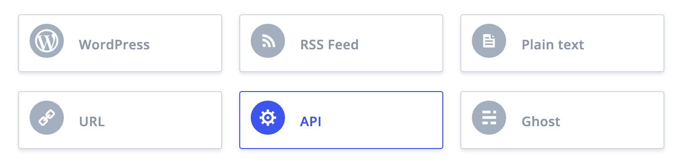
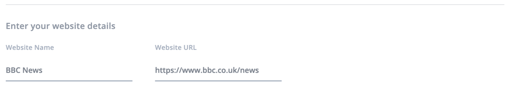
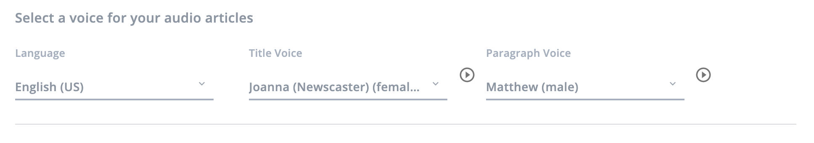
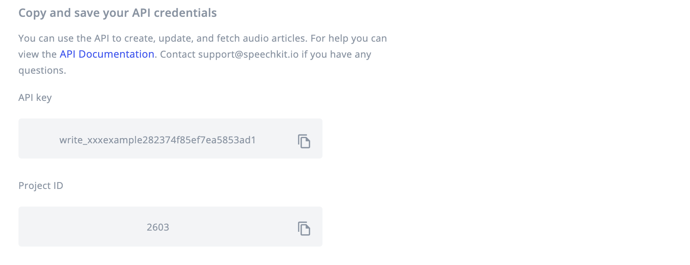

# API setup

### **Prerequisites**

To use SpeechKit you will need a SpeechKit account. [You can create one here](https://my.speechkit.io/auth/signup). 

## 1. Login to your SpeechKit account

You can login to SpeechKit using the email/password or Google credentials you used to create an account. 

If you're an enterprise customer, you can login to SpeechKit using the email/password provided to you by your account manager.

## 2. Create a new project

Firstly you will need to create a new project within the dashboard.

### 2.1. Select API

To start producing audio articles via an API, you will need to create an **API** project in your SpeechKit account.



### 2.2. Enter your website details

Once you have selected the API option, you will need to enter the following details about your website.

1. Enter the name of your website. For example: **BBC News**.
2. Enter the url address of your website. For example: . **https://www.bbc.co.uk/news.** 



## 3. Choose a voice to read your articles

Once you have entered your website details, you will need to select the language and voice\(s\) that will be used to produce your audio articles:  



### 3.1. Select a language

1. Select the language that your articles are written in. For example: **English \(US\)**. 

### 3.2. Select a voice

1. Select a voice to read your title. For example: **Joanna \(Newscaster\) \(Female\)**.
2. Select a voice to read the rest of the article. For example: **Matthew \(male\)**.

With the form now complete, click **Finish Setup** to finish creating the project.

## 4. Using the API to create, update and fetch audio

Once you have **Finished Setup**, you can get your API credentials from the project settings page. You will need both the API key and the Project ID to interact with the API, so have these available for the next steps.



### 4.1. Create an audio article

You can create an audio article using the POST request. Use the endpoint below to send your request to, providing all required parameters in the path or body of the request, along with any optional parameters you would like to use.


If you are using the API to both create and retrieve your audio, we advise including a unique **external\_id** with your request that relates to the content, so you can easily retrieve the audio when necessary using this same ID.




Post request to create an audio article



This endpoint allows you to add a new audio article to your project.   
All request parameters can be seen in the table below and example responses can also be seen in the response tab.






ID of the project you wish to add audio to





Your own internal ID



Text content of your article \(max 100,000 chars\)



Title of your article



Author of the article



Web page \(URL\) where the article is located



Your API key







Audio successfully created within the project.


```
{
  "id": 999,
  "external_id": "123-a",
  "state": "unprocessed",
  "media": [
    {
      "id": 999,
      "content_type": "mp3",
      "url": []
    }
  ],
  "deleted": false
}
```




Invalid request.


```

```




Invalid API key.


```

```




Wrong project ID.


```

```





### 4.2. Fetch an audio article by ID

Once you have created an audio article, it will be available via the API fetch. You can use the endpoint below to do this, making sure you include the project ID and audio ID in the path, along with your API key as a query parameter.



Get request to fetch audio article by ID



This endpoint allows you to retrieve details of an audio article using its ID.






ID of the project



ID or external\_id of the audio





Your API key







Audio edition successfully retrieved.


```
{
  "id": 999,
  "external_id": "123-a",
  "state": "processed",
  "media": [
    {
      "id": 999,
      "content_type": "mp3",
      "url": "http://link.to/the/file.mp3"
    }
  ],
  "deleted": false
}
```




Invalid API key.


```

```




Wrong project ID or audio ID.


```

```





If you would prefer to fetch a list of audio article under a specific project, you can  [Fetch audio articles by project](../api-setup/fetch-audio-articles.md) first, to see which audio articles are available and follow with the request for a specific audio article after using the endpoint above.

You can also [Update an audio article](../api-setup/update-audio-article.md) or [Delete an audio article](../api-setup/delete-audio-article.md) via the API - follow the links for related instructions on how to do these.

If you have any questions, comments or issues please contact [support@speechkit.io](mailto:support@speechkit.io).

