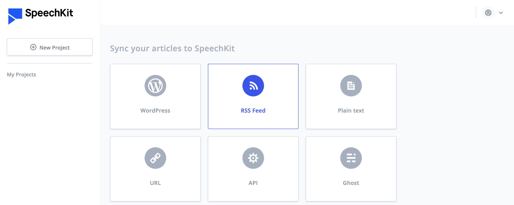
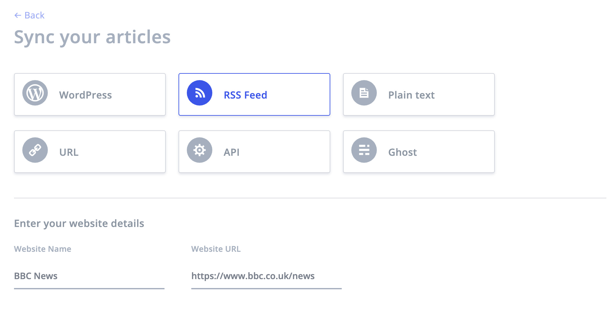
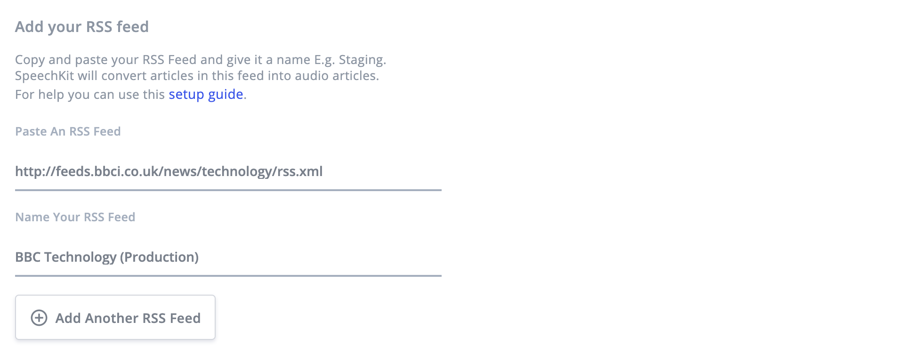

# RSS setup

### **Prerequisites**

To use SpeechKit you will need a SpeechKit account. [You can create one here](https://my.speechkit.io/auth/signup). 

## 1. Login to your SpeechKit account

You can login to SpeechKit using the email/password or Google credentials you used to create an account. 

If you're an enterprise customer, you can login to SpeechKit using the email/password provided to you by your account manager.

## 2. Create a new project

To get started you will need to create a project. Every SpeechKit account can have multiple projects. For example, you might have two news websites, such as **ABC News** and **XYZ News**. Each website should have its own project.

### 2.1. Select RSS Feed

To start producing audio articles from the articles published in your RSS feed\(s\), you will need to create an RSS project in your SpeechKit account. To do this, select **RSS Feed**. 

### 2.2. Enter your website details

Once you have selected the RSS option you will need to enter the following details about your website.

1. Enter the name of your website. For example: **BBC News**.
2. Enter the url address of your website. For example: . **https://www.bbc.co.uk/news.** 

## 3. Choose a voice to read your articles

Once you have entered your website details, you will need to select the language and voice\(s\) that will be used to produce your audio articles:  

### 3.1. Select a language

1. Select the language that your articles are written in. For example: **English \(US\)**. 

### 3.2. Select a voice

1. Select a voice to read your title. For example: **Joanna \(Newscaster\) \(Female\)**.
2. Select a voice to read the rest of the article. For example: **Matthew \(male\)**.

## 4. Connect your RSS feed\(s\)

SpeechKit fetches new articles from your RSS feed\(s\) every 10 minutes. Content from each article is extracted, cleaned, augmented with SSML and synthesised into audio \(this takes about 60 seconds per article\).

### 4.1. Add a single RSS feed

1. Copy your RSS feed URL and insert it. For Example: **http://feeds.bbci.co.uk/news/technology/rss.xml**.
2. Give your RSS feed a name. For example: **BBC Technology \(Production\)**. 

### 4.2. Add multiple RSS feeds

You can add and as many RSS feeds as you want. For example, you may have one RSS feed for Sports news and another for Business news. Or you may have one RSS for your staging/development environment and another for production environment.


 The audio player will use the article url to fetch the audio for each article. Hence, if you wish to test the audio player on your staging/development environment first, it is important to add and label your staging/development RSS feeds too. 

For example on **production** the article url might be **https://www.bbc.co.uk/news/technology-51709247** but on **staging/development** the article url might be **https://staging.bbc.co.uk/news/technology-51709247** or **https://test.bbc.co.uk/news/technology-51709247**


You can press the **Add Another RSS Feed** button to add more RSS feeds to your project. 

## 5. Save your Project settings

Once you have completed all of the above you must press the **Finish Setup** button to save your project settings. You will then be directed to your project dashboard.

## 6. Listen to your audio articles

Assuming that you have already subscribed to a monthly plan, or are an enterprise customer, you will start to see your audio articles appear in the Content section of your project dashboard. 


If you don't see any audio articles appear in the content tab, then press the ⟳ icon next to the project title. If after 5 minutes, you still don't see any audio articles, contact [support@speechkit.io](mailto:support@speechkit.io). 


## 7. Add the audio player to your article pages

One of the key benefits of using the RSS integration is an audio player will be inserted automatically alongside every article that is published in the RSS feed.

### 7.1. Adding the audio player code to your pages

To add the audio player to your articles you will need to go to the Distribution tab in your project dashboard. 

Once there, click on the edit icon \(pencil\). 

Each project has a unique embedded player code snippet, consisting of an iframe and a javascript file, which together, will render the audio player when audio is available.

1. Click on the copy icon on the bottom-right to copy the audio player embed code.
2. Add the audio player embed code into your article page template \(we recommend adding it just above the article body\). 

Once the embed code has been added to the article page template, the javascript will execute every time the page is loaded. It will use the article url to identify and fetch the corresponding audio for the article. This means that you don't need to add the embed code each time a new article is published.


If you are not happy with the size or position of the player, simply wrap the iframe with a div element and then add your CSS styles to the container div element.


### 7.2. Adding the audio player code to AMP pages

If your website is enabled for Google AMP, you will need to add a different code snippet to your AMP article template. We recommend you read our instructions on enabling [SpeechKit on AMP](../enhanced-features/speechkit-on-amp.md), which will guide you through this process.

