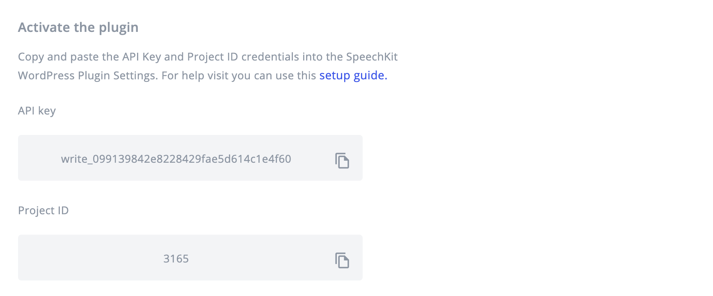

# WordPress setup

### **Prerequisites**

To use SpeechKit you will need a SpeechKit account. [You can create one here](https://my.speechkit.io/auth/signup). 

## 1. Login to your SpeechKit account

You can login to SpeechKit using the email/password or Google credentials you used to create an account. 

If you're an enterprise customer, you can login to SpeechKit using the email/password provided to you by your account manager.

## 2. Create a new project

To get started you will need to create a project. Every SpeechKit account can have multiple projects. For example, you might have two news websites, such as **ABC News** and **XYZ News**. Each website should have its own project.

### 2.1. Select WordPress

To start producing audio articles from posts published in WordPress, you will need to create a WordPress project in your SpeechKit account. To do this, select **WordPress**. 

### 2.2. Enter your website details

Once you have selected the WordPress option you will need to enter the following details about your website.

1. Website name. For example: **BBC News**.
2. Website URL. For example: **https://www.bbc.co.uk/news.** 

## 3. Choose a voice to read your articles

Once you have entered your website details, you will need to select the language and voice\(s\) that will be used to produce your audio articles:  

### 3.1. Select a language

1. Select the language that your articles are written in. For example: **English \(US\)**. 

### 3.2. Select a voice

1. Select a voice to read your title. For example: **Joanna \(Newscaster\) \(Female\)**.
2. Select a voice to read the rest of the article. For example: **Matthew \(male\)**.

## 4. Get your API Key and Project ID

You will need your API Key and Project ID to install and activate the SpeechKit WordPress Plugin.


**Testing SpeechKit on a staging website?** 

If you are testing SpeechKit on a staging website, we recommend that you create two projects \(each with their own API Key and Project ID\). Otherwise it is likely you will encounter issues.


## 5. Save your Project settings

Once you have copied and saved the API Key and Project ID you must press the **Finish Setup** button to save your project settings. You will then be directed to your project dashboard.


It is very important that you Finish Setup prior to adding the API Key and Project ID to the WordPress Settings page. Otherwise the Plugin will not work! 


## 6. Install and Activate the WordPress Plugin

### 6.1. Add the SpeechKit Plugin

1. Login to your WordPress admin. 
2. Go to **Plugins**.
3. Press **Add New**.
4. Search **SpeechKit**.
5. Press **Install Now**.

### 6.2. Activate the Plugin

### 6.3. Go to plugin settings

Once you have activated the plugin, go to the plugin settings.

### 6.4. Update plugin settings

1. Check that SpeechKit is **enabled**.
2. Enter the **API Key** that you saved earlier. 
3. Enter the **Project ID** that you saved earlier. 
4. Select the **post types** that you want created into audio articles.
5. **Enable Telemetry** - this sends us diagnostic data so that we can more easily help you resolve any issues that you might have. 
6. Press **Save** **Settings**. 

**Advanced Settings \(optional\)**


**Turn "Generate Audio" On by Default**

We recommend that you enable this to avoid having to select generate audio for every post. Once enabled then an audio article will be created each time that a post is published. 



**Marfeel Compatibility**

Enable this if your WordPress uses the [Marfeel Plugin](https://www.marfeel.com/). The audio player will not appear if you use Marfeel and this option is not enabled. 


## 7. Publish a post with audio

The SpeechKit WordPress Plugin is now activated on your WordPress website. This means that all new posts will have audio.


The SpeechKit Plugin adds a SpeechKit menu to the Add New Post screen. You can use this to either enable or disable audio for a specific post.


### 7.1. Add audio to a new post

To create a new post with audio:

1. Go to **Posts**. 
2. Press **Add New**. 
3. Enter **Post Title**. 
4. Enter **Post Text**.
5. Press **Publish**.

Once you press **Publish** go to view the post. The audio will take between 1-2 minutes to generate. Refresh the page and an audio player will appear between the post title and post text. 


You can track progress with audio in the **SpeechKit Status** column in Posts. 


### 7.2. Add audio to an existing post

To add audio to an existing post: 

1. Press **Edit** on your selected post. 
2. Go to the SpeechKit menu on the right and enable **Generate Audio**.
3. Press **Update**.

Once you press **Update** go to view the post. The audio will take between 1-2 minutes to generate. Refresh the page and an audio player will appear between the post title and post text. 


If you get an **ERROR** in the **SpeechKit Status** column then please contact support@speechkit.io with a link to your post. 


## 8. Listen to your audio article

Once published the audio will be available on the article via the SpeechKit player. 

## 9. Listen 

