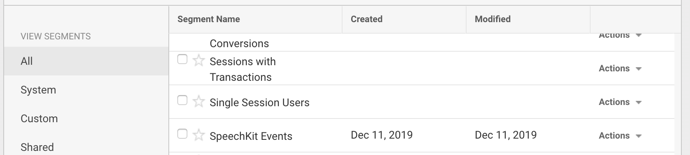

# Google Analytics

### Getting Setup


Note that this feature is still in beta and only available on request, so you will need to contact us in order to integrate.


Firstly, an active account with [Google Analytics](http://www.google.com/analytics) is required to use this feature. All we require to get you set up is your unique Google Analytics account number, which is the code that resembles _UA-XXXXXX-X_.


We advise creating a new view in Google Analytics specifically for the SpeechKit events, which can be done in the _Admin_ section.


Once we have activated Google Analytics for you, events will be sent directly to your Google Analytics account. 

### Making Sense of the data

Firstly, to confirm the events are arriving within the dashboard, browse to **Realtime &gt; Events** and you should see the new events within the Google Analytics dashboard.

All events will be have an **Event Category** of '_SpeechKit Player'_ ****so you can easily distinguish and filter all SpeechKit events. Each event will also have an **Action** property which describes the event type captured \(eg. _Load/Play_\) and a **Label** which will be the URL of the page on which the event occurred.

The current sent of **Event Actions** sent to Analytics from the player are:

* Load \(Fired once, when the player has loaded\)
* Play \(First time the user clicks play. Subsequent play/pause events are not currently recorded\)
* 25% Listened
* 50% Listened
* 75% Listened
* Complete

If you also have ads enabled, you may see the following ad-related events:

* Ad Play
* Ad 25% Listened
* Ad 50% Listened
* Ad 75% Listened
* Ad Complete
* Ad Link Click
* Ad Logo Click

If you then scroll down and select an **Event Action**, you should see a list of the events along with the percentage of users. This offers a simple overview of how your users are engaging with the content.

### Creating Segments to filter the data

We can also use segments to better view the SpeechKit Events within the dashboard.

Firstly, go to **Behaviour** &gt; **Events** &gt; **Overview** in the menu on the left. Now click **+ Add Segment** and you will see a list of segments appear. 

Instead of choosing an existing segment, click the button to **Create a New Segment** and add a **Segment Name** of **SpeechKit Events**.

Select **Conditions** from the menu on the left and use the dropdown to select  **Behaviour** &gt; **Event Category**, then **contains** and type **SpeechKit Player** to make sure this segment only includes the SpeechKit events.

**Save** the segment and you can now start using it to filter your data.

Before we look at the data, we will create one more segment. Click **Create a New Segment** again and call this one **SpeechKit Player Interaction**.

Select **Conditions** from the menu on the left and use the dropdown to select  **Behaviour** &gt; **Event Action**, then **contains** and select **Play,** then **Save**. 

This segment will allow us to filter by users who have clicked play.

### Using segments to view the data

We can now use the segments we created to filter the Analytics data. For this example we will filter the users by age demographic. 

Navigate to **Audience** &gt; **Demographics** &gt; **Overview** and click **Add Segment.** Scroll down the list of segments until you see **SpeechKit Events** and **SpeechKit Player Interaction** segments. 

Tick the box to the left to select both segments and click **Apply** to add them to the view.

In this example, we can see the age distribution of users who had the SpeechKit player load on the page \(orange\), compared to those who pressed play on the player \(green\).

It is quite clear that those users interacting with the player are generally younger in age. You can apply these segments to other analytics to help learn more about your users.

